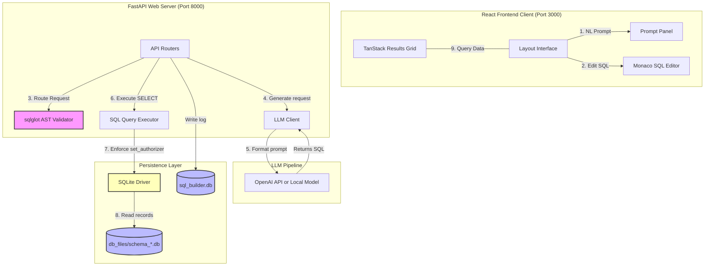

# System Architecture

This document describes the high-level architecture of the **AI-Powered SQL Query Builder & Data Explorer** application, showing the relationships between frontend components, FastAPI service layers, and local storage.

## Architecture Overview

The system follows a clean separation of concerns:
1. **Frontend Layer**: React SPA built with Vite, utilizing Zustand for reactive UI states and Material UI for layouts.
2. **API Gateways**: Python FastAPI endpoints, which serialize data transfer objects (DTOs) via Pydantic.
3. **Core Services**:
   - `SchemaService`: Handles AST-based parsing and SQLite sandbox instance builds.
   - `LlmClient`: Directs OpenAI-compatible prompts with strict dialect instructions.
   - `QueryExecutorService`: Runs read-only queries with low-level execution limiters.
4. **Security Layer**: Combines AST-walking (`sqlglot`) and database-driver write-prevention rules (`sqlite3` authorizer).
5. **Persistence**:
   - Application DB (`sql_builder.db`): Stores history, favorites, saved templates, and metadata.
   - Database Sandboxes (`db_files/schema_{uuid}.db`): Isolated SQLite files generated dynamically for each uploaded schema.

---

## Architectural Diagram

The diagram below visualizes the flow of a user query execution request:



## Package & Folder Structure

```text
backend/
├── app/
│   ├── api/            # API Controllers (REST routes)
│   ├── database/       # SQLAlchemy engine and session configurations
│   ├── llm/            # OpenAI LLM connector and offline fallback generators
│   ├── models/         # SQLAlchemy schemas (QueryHistory, SavedQuery, etc.)
│   ├── repositories/   # Entity persistence managers
│   ├── schemas/        # Request/Response serializations (Pydantic)
│   ├── security/       # AST validators and SQLite authorizers
│   ├── services/       # Core business logic (executors, parsers)
│   └── utils/          # Database seeding scripts
└── tests/              # Pytest backend validation suites

frontend/
├── src/
│   ├── components/     # UI components (Monaco, TanStack Table, Sidebar)
│   ├── layouts/        # Responsive multi-column layout
│   ├── services/       # Axios API client bindings
│   ├── store/          # Zustand store state management
│   ├── types/          # TypeScript interface definitions
│   └── index.css       # HSL dark theme stylesheet
```
